# 🧠 Mind Haven

# 📖 Introduction

Mind Haven is a portfolio project created as part of the [Code Institute Full Stack Software Developer Bootcamp](https://codeinstitute.net/). This website is dedicated to raising awareness about mental health, providing valuable information, and creating a supportive space for those seeking guidance. Built using HTML5, CSS3, and Bootstrap, the project demonstrates essential front-end development skills while fulfilling the course’s learning objectives. Its primary goal is to educate visitors on mental health topics and encourage open conversations to reduce stigma.

The live project can be found here: [Mind Haven](https://ozzymara.github.io/mind-haven/)

## 📜 Table of Contents

- [🗺️ Project Outline](#-project-outline)
  - [🎯 Key Objectives](#-key-objectives)
  - [🧐 UX Design](#-ux-design)
  - [👤 User Stories](#-user-stories)
  - [🎨 Colours](#-colours)
  - [🔠 Fonts](#-fonts)
  - [📱 Wireframes](#-wireframes)
  - [🖼️ Imagery](#-imagery)
- [✨ Features](#-features)
  - [🏷️ Title and Favicon](#-title-and-favicon)
  - [📧 Contact Form](#-contact-form)
  - [🧭 Nav Bar](#-nav-bar)
  - [❇️ Hero Section](#-hero-section)
  - [💭 Inspirational Quotes Carousel](#-inspirational-quotes-carousel)
  - [🗂️ Information Cards](#-information-cards)
  - [📚 Useful Resources](#-useful-resources)
  - [🔚 Footer](#-footer)
  - [🕹️ Responsive Website Implementation](#-responsive-website-implementation)
- [🛠️ Built With](#-built-with)
  - [🖥️ Technologies and Languages](#-technologies-and-languages)
  - [📚 Libraries and Frameworks](#-libraries-and-frameworks)
  - [🧰 Tools and Programs](#-tools-and-programs)
  - [⚙️ Related Technologies Used](#-related-technologies-used)
- [🗃️ File Structure](#-file-structure)
- [🧪 Testing and Validation](#-testing-and-validation)
  - [✅ Manual Testing](#-manual-testing)
  - [✅ HTML Validation](#-html-validation)
  - [✅ CSS Validation](#-css-validation)
  - [✅ JS Validation](#-js-validation)
  - [✅ Chrome DevTools Lighthouse](#-chrome-devtools-lighthouse)
  - [✅ Semantic HTML](#-semantic-html)
- [🚀 Deployment](#-deployment)
- [🙌 Credits](#-credits)
  - [⌨️ Code](#-code)
  - [📝 Content](#-content)
  - [🎥 Media](#-media)
  - [🤖 AI Implementation and Orchestration](#-ai-implementation-and-orchestration)
  - [🧡 Acknowledgements](#-acknowledgements)
  - [💡 Future Ideas](#-future-ideas)
  - [🆕 Recent Updates](#-recent-updates)

 

# 🗺️ Project Outline
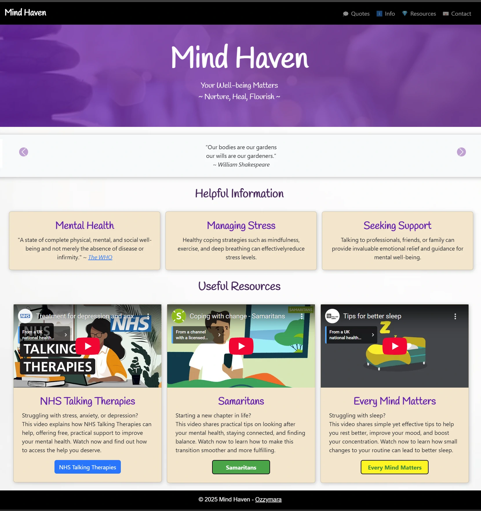
 
MHA is a fully responsive, accessible, single-page web application designed to promote mental health awareness, offer valuable resources, and inspire users with positive affirmations and quotes. This project provides easy access to highly recommended healthcare services in the UK, ensuring users can find support effortlessly.

As part of my portfolio project for the [Code Institute Full Stack Software Developer Bootcamp](https://codeinstitute.net/), the project focuses on implementing HTML5, CSS3, and Bootstrap to create a user-centric web experience that meets industry best practices in responsiveness, accessibility, and aesthetics.

🔗 Quick Links  
[Live Site](https://ozzymara.github.io/mind-haven/)  
[User Story Board](https://github.com/users/Ozzymara/projects/6)

## 🎯 Key Objectives

● **Promote mental health awareness**: provide accessible, easy to navigate beginner-friendly information about mental health, including how to recognise common issues and manage stress.

● **Support and empower users**: offer a welcoming, supportive environment with concise positive messaging and affirmations to encourage users and reduce stigma around mental health issues.

● **Connect users to trusted resources**: highlight and link users to reputable external mental health resources for further support and information.

● **Deliver a calming, accessible experience**: use a clean, calming design with a soothing colour palette, clear structure, and responsive layout to ensure the site is easy to use on all devices.

● **Ensure accessibility and usability**: adhere to accessibility best practices (colour contrast, alt text, semantic html) so the site adheres to all necessary standards and accessibility requirements.
 

<a href="#-mind-haven">Back To Top</a>

# 🧐 UX Design

Designing a website that prioritises mental health required a thoughtful approach that balances aesthetics, accessibility, and user experience.

## 👤 User stories

The user stories for this project as well as their acceptance criteria and tasks can be found in the project board.

🔴 **Must-haves - Site Owner’s Goal**

**Clean & Supportive Web Design**: The site owner wants to create a welcoming webpage that provides basic mental health information using a clean and supportive design. The focus is on using HTML and CSS with Bootstrap to create a calming and well-organised user experience.

🟠 **External Users’ Goal**

The users seek accessible, beginner-friendly information on mental health, including how to recognise common issues and manage stress, presented in a supportive and organised layout.

Should-haves

1. Hero Section with Positive Messaging: As an external user, I want a Bootstrap Jumbotron with an encouraging message about mental health, using a calming colour scheme and a simple background image.
2. Information Cards for Mental Health Tips: As an external user, I want to use Bootstrap’s card components to present mental health tips and common issues, providing a visually appealing way to organise content.
3. Positive Affirmations Section: As an external user, I want to use Bootstrap’s text utilities to include a section with uplifting quotes or messages to encourage users.

Could-haves

4. Resource Links in a Grid Layout: As an external user, I want a grid layout for external links to mental health resources styled with Bootstrap buttons to make them stand out.
5. A dynamic carousel for inspirational quotes at the top of the page. 
6. Develop a user-friendly messaging feature with clear input fields and submission functionality.

## 🎨 Colours

Colour selection carried greater significance for my project due to the specific needs of the end user and the importance of creating a visually appealing design. The chosen colours and artwork played a fundamental role in shaping a visually inviting and considerate space, ensuring that the design not only meets aesthetic expectations but also enhances user experience and well-being.
Through extensive research, inspiration, and feedback, I carefully crafted a colour scheme that balances calmness, engagement, and accessibility. This approach incorporates elements of general colour theory alongside personal insights to create an intuitive and harmonious interface.

To guarantee adherence to accessibility standards, the [Colour Contrast Checker](https://colourcontrast.cc/) (also available as a Chrome extension), [WebAIM](https://webaim.org/resources/contrastchecker/) Contrast Checker, and [Adobe Color](https://color.adobe.com/create/color-contrast-analyzer) tools were used to validate contrast levels. These tools helped to make informed decisions  with regards the final design.

| Main Palette  | Hex     | RGB             | Foreground | Hex     | RGB             |
| ------------- | ------- | --------------- | ---------- | ------- | --------------- |
| Black         | #000000 | (0, 0, 0)       | White      | #FFFFFF | (255, 255, 255) |
| Medium Orchid | #8848A5 | (136, 72, 165)  | White      | #FFFFFF | (255, 255, 255) |
| Beige         | #F5E6CD | (245, 230, 205) | Purple     | #F5E6CD | (245, 230, 205) |
| Lavender Gray | #EAE0EB | (234, 224, 235) | Black      | #4A235A | (74, 35, 90)    |

Click to view colour palette

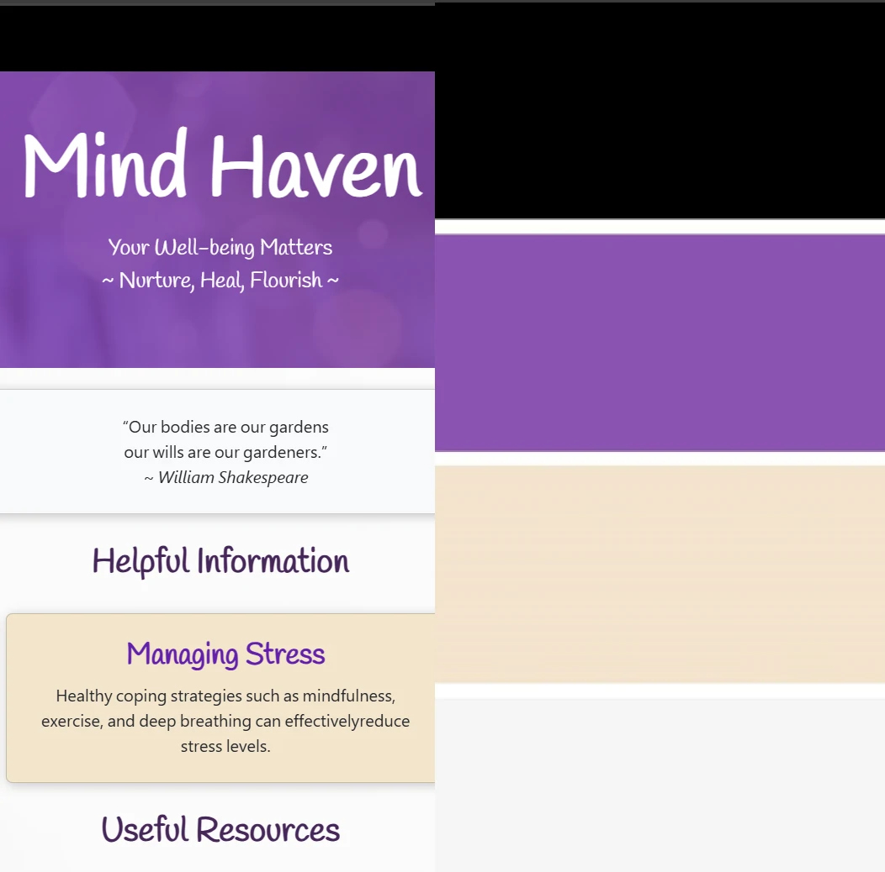

Click to view contrast results

Click to view results for AA and AAA

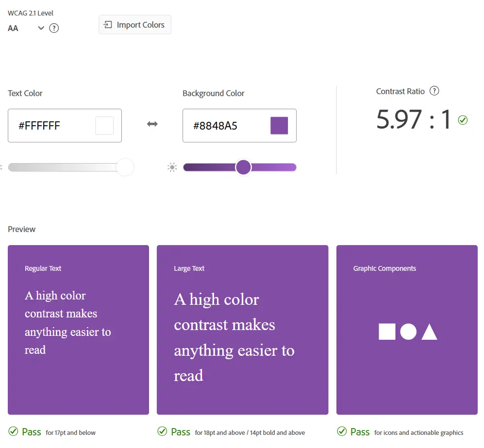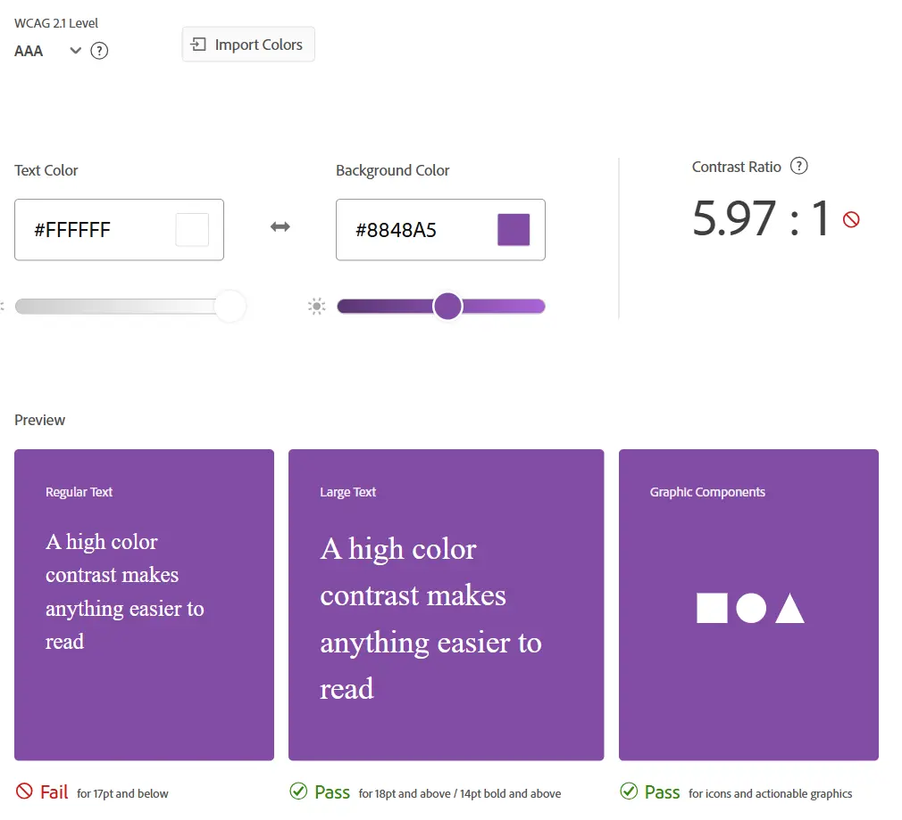

 
A combination of #8848A5 (Medium Orchid) and #FFFFFF (White) fails the Web Content Accessibility Guidelines (WCAG) AAA contrast test for normal text. However, this failure has occurred because the contrast checker does not take font size into account. Under the WCAG, AAA is the highest standard for readability. For normal text smaller than 24px, the luminance ratio between the lighter and darker colours must be at least 7:1 to ensure maximum readability for users with visual impairments. In my design, the Jumbotron text sizes are 32px (for 2rem) and 25.6px (for 1.6rem). Since both sizes exceed 24px, they qualify as large text under WCAG rules. As a result, they need a contrast ratio of only 4.5:1, rather than the stricter 7:1 required for smaller text. Thus, despite failing the AAA test for normal text, the Medium Orchid and White combination meets WCAG AAA for large text in my design.

| Level of accessibility | Font readability | Normal Text(smaller than 24px) | Larger Text(greater than 24px) | Graphic components |
| --- | --- | --- | --- | --- |
| AAA | Fonts should be clear and legible | 4.5:1 (N/A) | 3:1 | 3:1 |
| AA | Requires simplified language for readability | 7:1 (N/A) | 4.5:1 | 3:1 |

Moreover, the chosen colours align with the website’s design reinforcing its recognition and visual appeal. The combination also offers a soft, approachable look that fits the intended audience, especially in mental health awareness contexts where calming tones matter.

## 🔠 Fonts

As with colour, font was a big consideration for ensuring a positive user experience whilst visiting the page. For the headings, [Google Fonts’ Handlee](https://fonts.google.com/specimen/Handlee) (sans-serif) was chosen. Handlee for Headings – Handlee’s casual, handwritten style makes titles feel personal, inviting, and warm. This is especially useful for topics like mental health awareness. The soft, organic letterforms evoke a sense of approachability that formal fonts might lack. It subtly encourages engagement, making visitors feel welcome and reassured.

For the main text, Arial (sans-serif) was used because it offers clarity, readability, and accessibility, making it easier for users to absorb important information. Arial is a clean, modern, and highly readable typeface. It is designed for clarity across different screens and resolutions, ensuring a smooth reading experience. The professional but friendly appearance keeps the focus on the content, allowing for easy comprehension without visual distractions.

The Handlee headings add warmth and personality, while Arial keeps things professional and accessible. Together, they make information easy to absorb while fostering a sense of care and connection.

## 📱 Wireframes

Wireframes play a crucial role in shaping a website’s architecture, ensuring a cohesive and well-optimised experience for users. The wireframes for this project have been created using [Balsamiq](https://balsamiq.com/) to define the core feature layout, ensuring a user-friendly experience that prioritises clarity and ease of navigation. These low-fidelity wireframes serve as a foundational guide for structuring the site's design and responsiveness across different screen sizes.

Click to view wireframes mobile, tablet, and desktop

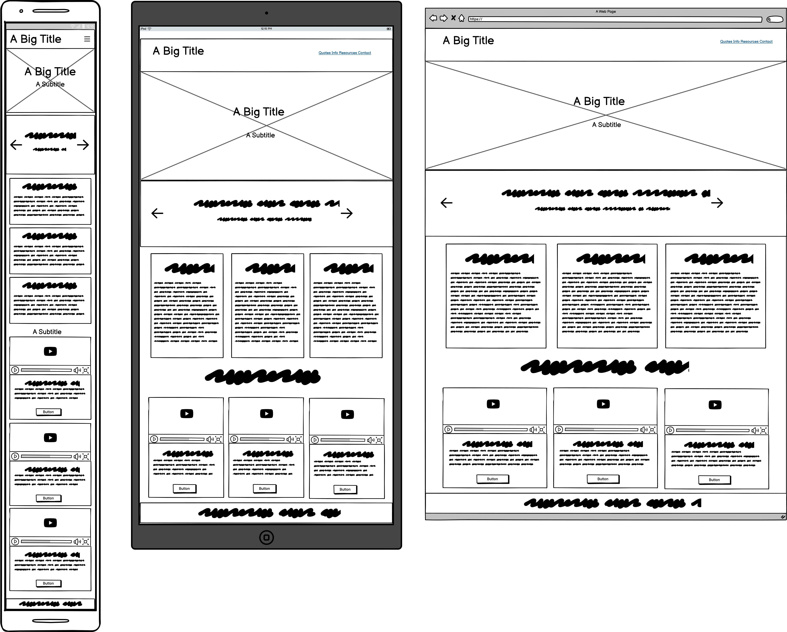

 

## 🖼️ Imagery

The **Mind Haven** website utilises carefully selected imagery to create a welcoming, calming, and supportive environment.  Two images were selected from [Freepik](https://www.freepik.com/), which is an online platform that provides a vast collection of royalty-free images, vectors, illustrations, icons, and templates for creative projects. For the MHA website, two images were selected: one for the main body and the second one for the jumbotron.

Background image for main body

Click to view background image

 

This image is a large-scale piece with predominantly shades of light grey and white, with subtle darker grey accents. The organic shapes resemble smoke or clouds, creating a sense of depth and movement that adds an ethereal, tranquil quality to the design. This choice ensures the background remains visually engaging while maintaining a light and unobtrusive presence, allowing text and content to stand out.

Calm: The background image is set to 35% opacity, making it quite subtle and allowing content above it to stand out.

Original Jumbotron Image

Click to view original jumbotron Image

 

Click to view  finalised jumbotron Image

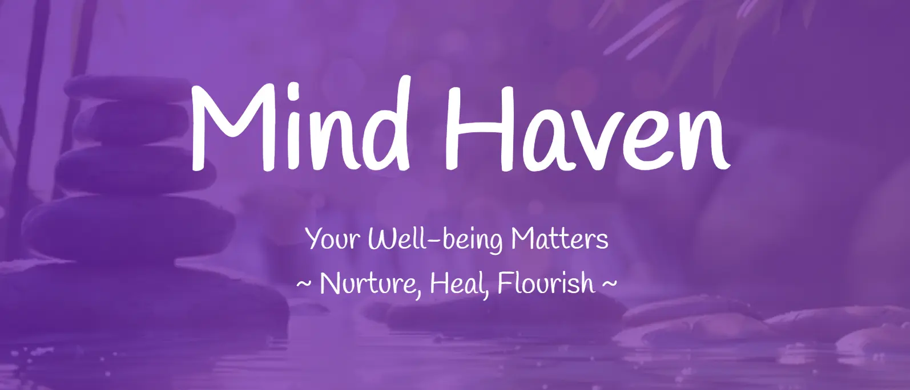

 
The Jumbotron image is a tranquil scene of a zen garden. The image shows a stack of smooth, dark grey stones sitting atop larger, flat stones in a shallow pool of clear, greenish-coloured water. The water’s surface reflects the surrounding greenery and light. Blurred in the background are lush, green foliage, including bamboo, and a gentle waterfall cascading over rocks. Soft, golden light streams through the foliage, giving a serene and peaceful ambiance to the image. Bokeh effects are present in the background, adding to the dreamy atmosphere.

Purple overlay
To ensure optimal readability while preserving the site's calming aesthetic, a purple overlay of deep and light purple was applied with an opacity of 80% transparency to the jumbotron image. Purple was selected it is commonly associated with wellness, emotional balance, and tranquillity. This style creates a smooth colour transition from deep purple to a slightly lighter shade, with a diagonal flow. This adjustment also makes the heading and subheading stand out clearly.

**Accessibility** 
• All images have alt text, meaning that screen readers can describe the images for users who have difficulty seeing.  
• High colour contrast ensures readability for people with vision impairments.  
• Fonts are carefully chosen to be large enough for easy reading.  
• The website uses semantic HTML, which ensures that assistive technologies (such as screen readers) can interpret the content correctly. 

By integrating these images and design enhancements, the site establishes a soothing and supportive environment, reinforcing the mental health awareness theme while ensuring usability and accessibility for all users.
 

<a href="#-mind-haven">Back To Top</a>

# ✨ Features

This website is designed for clarity and ease of use and is structured to encourage engagement and support.

## 🏷️ Title and Favicon

Click to view browser title

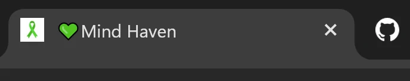
 
• The title of the website, "💚Mind Haven" appears at the top of the browser tab and at the top of the page. This makes it easy for users to recognise and understand the site's purpose. 

• The favicon (the small icon next to the site title in the browser tab) is a green ribbon - a universal symbol for mental health awareness; image courtesy of [iStock Photos](https://www.istockphoto.com/). The icon helps users quickly identify the site when they have multiple tabs open. 
• The scrolling title using JavaScript is a great way to subtly advocate for mental well-being. Unlike static text, a moving title grabs attention and makes the website stand out with a simple but meaningful effect.

## 🧭 Nav Bar

Click to view navbar

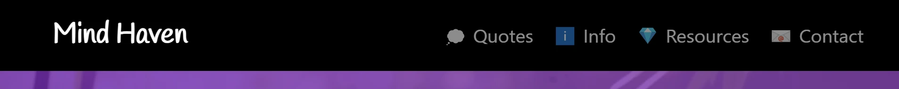
 

• The navigation bar is a menu at the top of the website that stays visible as users scroll. This feature makes it easy to move between sections without needing to scroll all the way back to the top.  
• The navbar includes links to important sections: Resources, and Quotes. These links allow users to find information easily. This is a single page website and so the navigation links only link to anchors on the page.  
• On smaller screens, such as phones and tablets, the menu turns into a hamburger menu (three horizontal lines). Users can tap on it to open the menu and access different sections.

## 📧 Contact Form

Click to view contact form

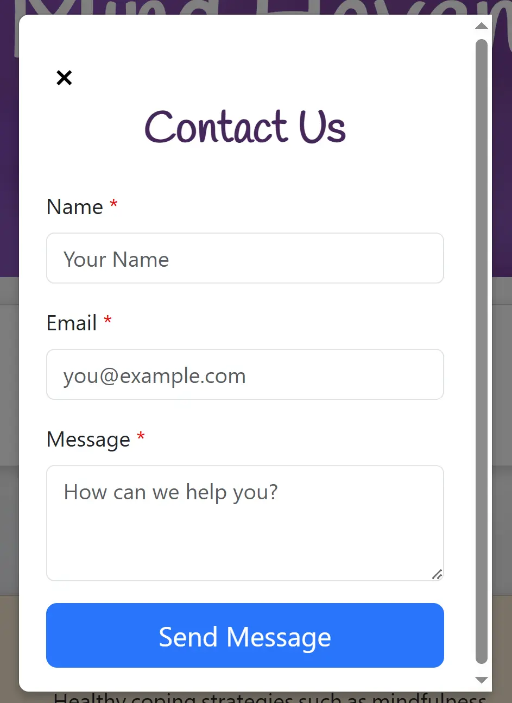
 

• This contact form is a crucial component of the website, allowing visitors to reach out directly to the site owner or support team to submit inquiries, feedback, or support requests without needing to send an email manually. 
• The form consists of fields for name, email, and message, to ensure structured communication.

## ❇️ Hero Section

Original Jumbotron Image

Click to view original jumbotron Image

 

Click to view  finalised jumbotron Image

 

• The hero section is the first thing users see when they land on the site. It sets the tone with a calming background image and a soft overlay (a transparent purple filter over the image) to make the text stand out and to create a peaceful and supportive feeling.  
• The font size is large so that it is easy to read.  
• This section contains a welcoming headline and a brief introduction that explains mental health.

## 💭 Inspirational Quotes Carousel

Click to view the quotes section

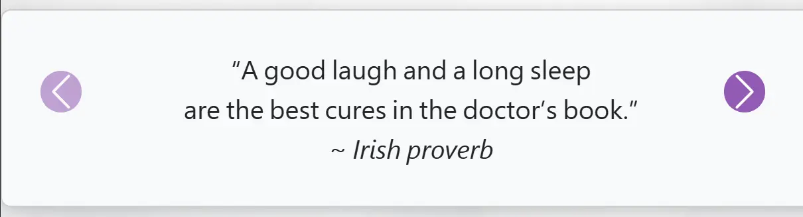
 

• This section displays inspirational quotes designed to uplift and encourage users.  
• The quotes are displayed within a carousel, ensuring they remain readable against the background image.  
• Each quote is presented in clear, legible text, with the author's name formatted in small, italicised text for a clean and unobtrusive design.

## 🗂️ Information Cards

Click to view the information cards

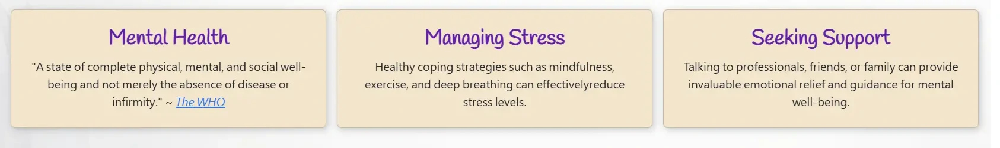
 

• [Bootstrap cards](https://getbootstrap.com/docs/5.3/components/card/) are placed in a grid layout, meaning they arrange themselves automatically to fit different screen sizes. On larger screens, they appear side by side, while on smaller screens, they stack vertically.  
• Each card has a clear heading and a short description with useful information.  
• The background and text colours are carefully chosen to ensure that the content is easy to read and visually soothing.

## 📚 Useful Resources

Click to view the resources section

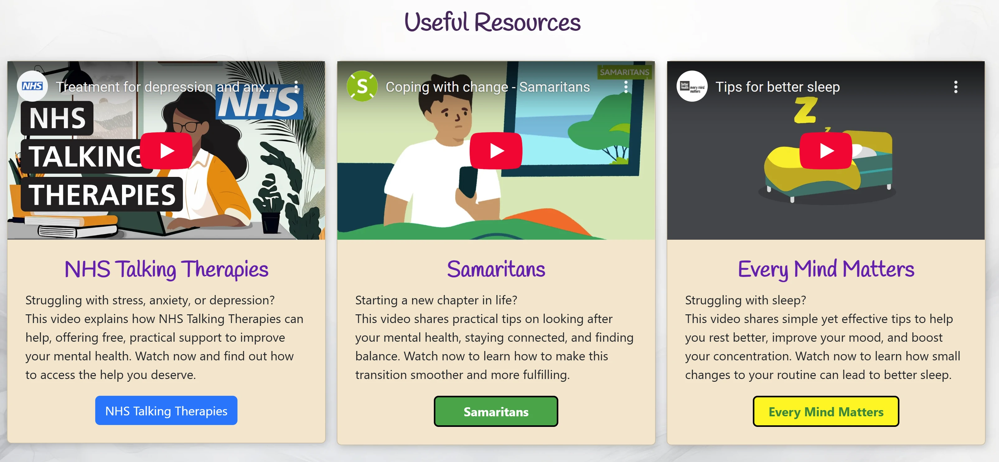
 

• There are big, colourful buttons that link to trusted mental health resources, such as NHS, Samaritans, and Every Mind Matters.  
• These buttons are designed to stand out, making them easy to find.  
• On mobile devices, the buttons are stacked vertically and centred, so they are simple to tap with a finger.  
• Clicking on a button opens the resource in a new tab, ensuring that users avoid losing their place on the site.

## 🔚 Footer

Click to view the footer

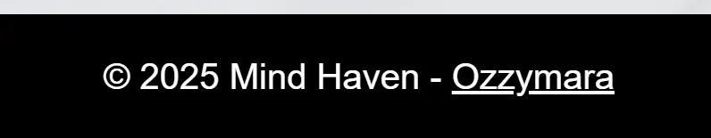
 

• The footer has the same style as the navigation bar for consistency.
• The footer contains link to the author's GitHub account.

## 🕹️ Responsive Website Implementation

This website is fully responsive, meaning it automatically adjusts to different screen sizes, whether viewed on a mobile phone, tablet, or desktop.

Click to view responsiveness

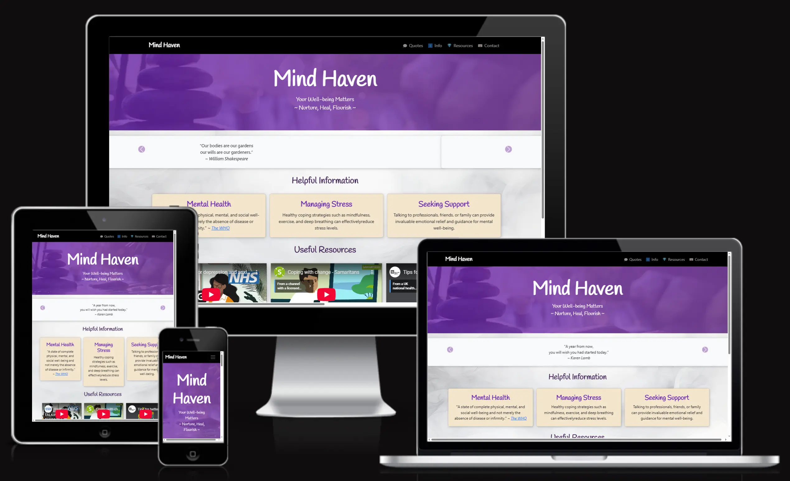
 

Implementation Details

• The [Bootstrap framework](https://getbootstrap.com)  allowed for a responsive design without the need for additional CSS or media queries.  
• In some instances, responsiveness required fine-tuning and troubleshooting, particularly with the assistance of GitHub Copilot, an AI-powered coding assistant designed to help developers write code more efficiently. It provides real-time code suggestions, automates repetitive tasks, and even helps debug and refactor code.  
• While some awkward elements still exist, the site successfully adapts to various screen sizes.
 

<a href="#-mind-haven">Back To Top</a>

# 🛠️ Built With  
  
##  🖥️ Technologies and Languages  
  
 The core language for structuring web content.  
  
 A lightweight markup language used for documentation and formatting text.  
 A versatile scripting language used to enable dynamic title scrolling in browsers.  
  
## 📚 Libraries and Frameworks  
  
   A front-end framework for responsive and mobile-friendly design.  
 Provides scalable vector icons for UI design.  
  Used to integrate custom typography into web projects.  
  
## 🧰 Tools and Programs  
  
   A platform for version control and collaborative development.  
  Used for creating wireframes and planning UI layouts.  
  An AI assistant that enhances productivity and creative workflows.  
 AI-powered code completion to assist with coding tasks.  
 A code editor used for writing, debugging, and version control.  
  A set of web development tools built directly into Google Chrome for debugging and optimising websites.  
  
## ⚙️ Related Technologies Used  
  
 Helps visualise and plan web designs before development.  
   Ensures the code follows web standards for accessibility and correctness.  
 Used to audit and optimise web applications for speed and accessibility.  
  Integrates with GitHub to track changes and manage projects efficiently.  
   A tool for previewing how websites appear on different screen sizes and devices.  
  Green ribbon icon used to represent meantal health awareness.

   

<a href="#-mind-haven">Back To Top</a>
  

## 🗃️ File Structure  
Mind Haven  
├── index.html  
├── README.md  
├── assets/  
│ ├── css/  
│ └── images/  
│ └── js/  
│ └── documentation/readme-images 
 

<a href="#-mind-haven">Back To Top</a>

# 🧪 Testing and Validation

Overview
Throughout the course of the project, testing and validation were conducted to ensure functionality, responsiveness, and usability. Importantly, testing in Incognito Mode is crucial because it provides a clean testing environment without cached data, stored cookies, or browser extensions interfering with the site’s ur. Essentially, it mimics a first-time visitor's experience, making sure the site works as expected for new users without any hidden browser influences.

Testing Methods

• **Debugging and Browser Tools**: Regular debugging and testing were performed using [Chrome DevTools](https://developer.chrome.com/docs/devtools) to analyse and troubleshoot issues efficiently.  
• MHA Testing Sheet: A structured approach was followed using the MHA testing sheet (Google read-only) to verify compliance and accessibility.  
• Peer Code Review: Colleagues and members of the Slack community provided a "fresh set of eyes" through peer code reviews, helping identify potential issues that were overlooked.

## ✅ Manual Testing

1. Navigation
   o Verified links hover effects
   o Verified all navigation links work correctly
   o Tested responsive navbar on multiple devices
2. Resources Page
   o Tested all external links
   o Verified buttons hover effects
   o Confirmed responsive layout
3. Responsiveness
   All tests were conducted in [Chrome DevTools](https://developer.chrome.com/docs/devtools), using the device toolbar for the following customised dimensions:

   o Mobile from 360x640 to 414x896  
   o Tablets from 601x962 to 1280x800  
   o Laptops 1280x720 to 1920x1080

## [✅ HTML Validation](https://validator.w3.org/#validate_by_input)

The website now has no errors.

Click to view HTML validation results

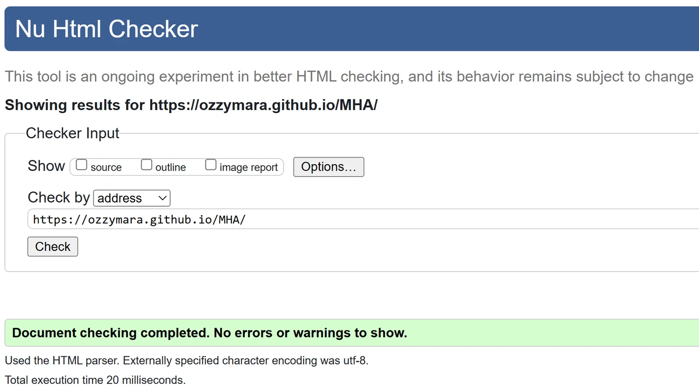
 

When MS Copilot generated code, occasional stray elements like &lt;/span&gt; and other closing tags appeared due to the way it predicted and completed code snippets. These errors were flagged during HTML validation and were corrected in [VS Code](https://code.visualstudio.com/download).

## [✅ CSS Validation](https://jigsaw.w3.org/css-validator/#validate_by_input)

Click to view CSS validation results

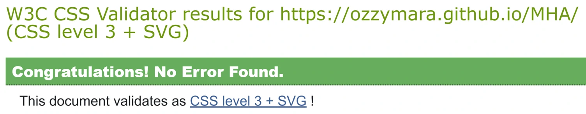
 

No errors found. 3 warnings arose from importing google fonts which are outside of the scope of this project.

## [✅ JS Validation](https://jshint.com/)

Process: One JavaScript file was validated using JSHint. N no syntax errors were found. Codes found to adhere to best practices.

Click to view JS validation results

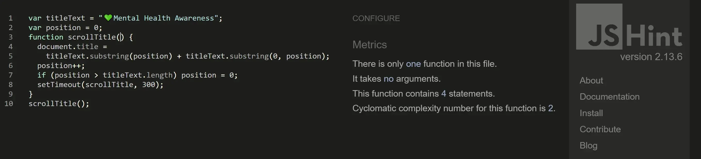
 

## [✅ Chrome DevTools Lighthouse](https://developers.google.com/web/tools/lighthouse/)
• A Lighthouse audit was conducted using the tool on Chrome DevTools of each web page.  
• All categories 90-100 in Lighthouse.  
• Overall, Lighthouse testing score of 94 for mobile and 99 for desktop.

Mobile

Click to view Lighthouse results for mobile

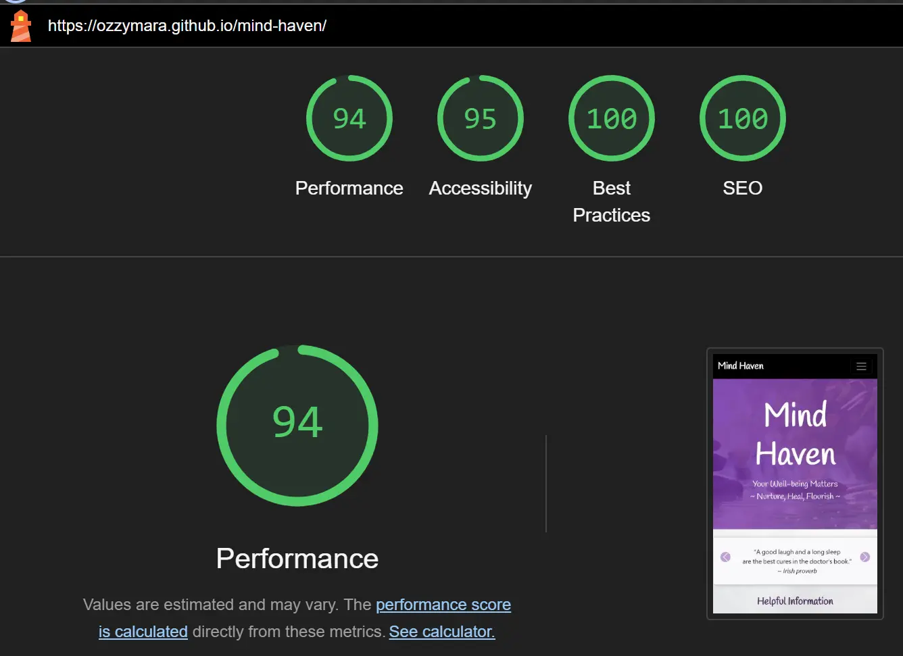
 

Desktop

Click to view Lighthouse results for desktop

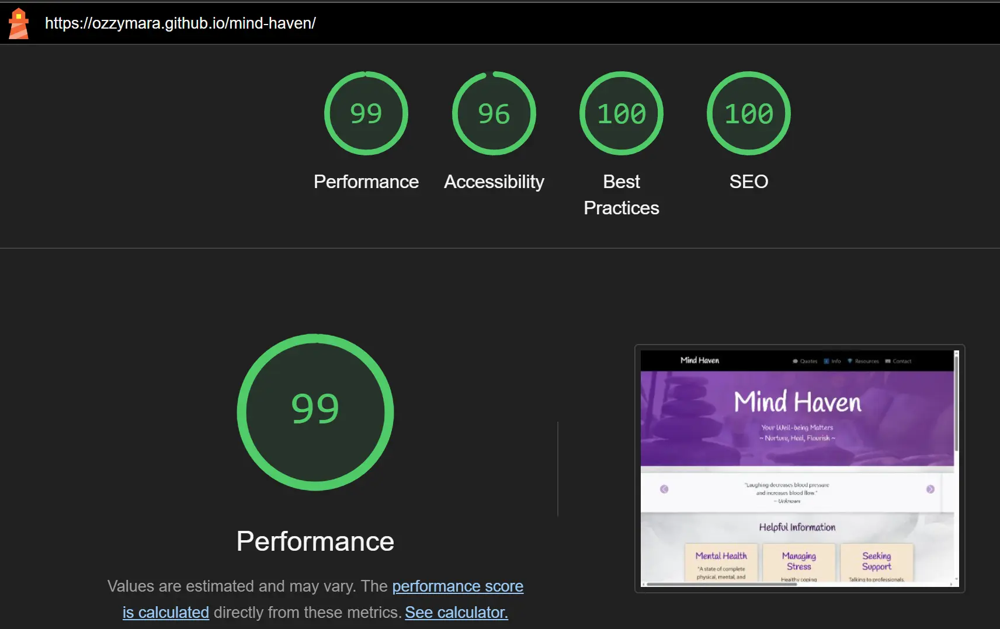
 
 

Testing Results:

In depth testing has been carried out, all results are shown below in the test results sheet:

Click to view test grid

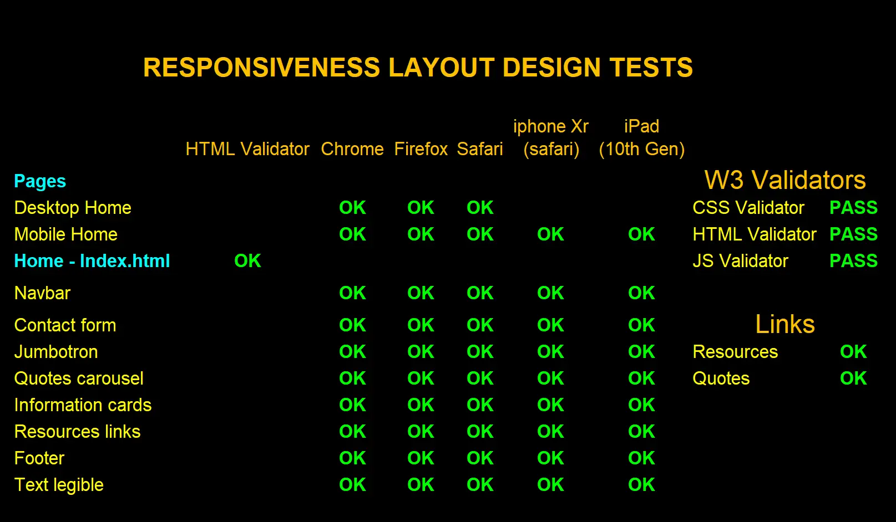
 

This test sheet displays the results of responsiveness and validation tests conducted across various devices and browsers. The tests confirm that key elements such as the navbar, jumbotron, information cards, resources, quotes, and footer function correctly on Chrome, Firefox, Safari, iPhone Xr, and iPad. Additionally, CSS and HTML validation have passed successfully. Links to resources and quotes are also functional.

## ✅ Semantic HTML
This project uses semantic HTML elements throughout to enhance accessibility and ensure a logical structure for all users, including those using assistive technologies.

**How Semantic HTML is Applied in This Project:**

- **Key Elements:**  
  - `<nav>` is used for the navigation bar, helping screen readers identify the main site navigation.
  - `<header>` contains the hero section and site introduction.
  - `<section>` is used to group related content, such as information cards, resources, and quotes.
  - `<footer>` provides consistent site information and links at the bottom of the page.

- **Headings:**  
  - Proper heading tags (`<h1>`, `<h2>`, `<h3>`) are used in a logical order to structure content and improve navigation for screen readers.

- **Accessible Images:**  
  - All images include descriptive `alt` attributes, ensuring content is accessible to users with visual impairments.

- **Navigation:**  
  - Navigation links use clear anchor tags (`<a>`) with descriptive text and ARIA labels where appropriate.

- **Interactive Elements:**  
  - Buttons and links are implemented using semantic tags and are keyboard accessible.

**Example from this project:**

Click to view examples from the initial version of this project

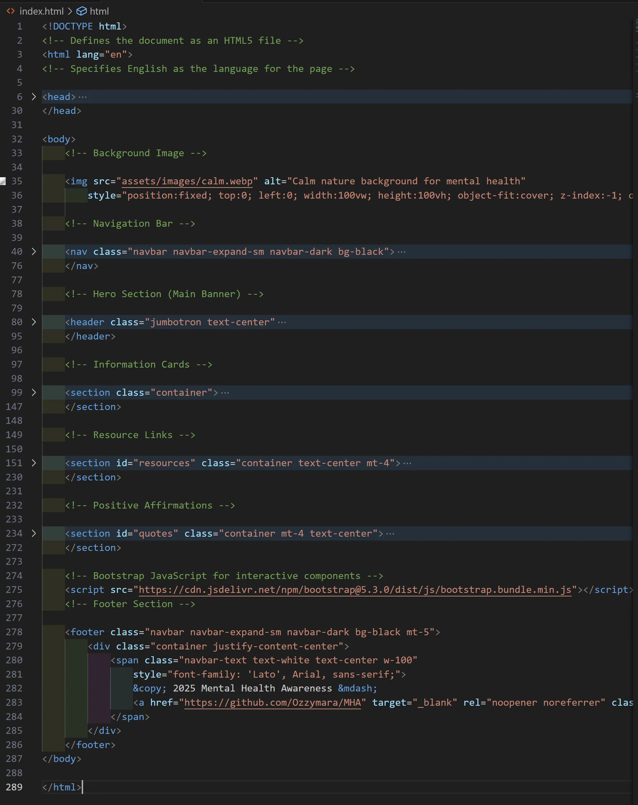
 

By using these semantic elements, the site is easier to navigate, more accessible to assistive technologies, and better aligned with web standards.
   

<a href="#-mind-haven">Back To Top</a>
  

# 🚀 Deployment

This project was developed using Visual Studio Code (VS Code) and version-controlled via GitHub. The main branch serves as the live deployment source.

**Features**  
Developed in [VS Code](https://code.visualstudio.com/download)    
Managed with [GitHub](https://github.com/)  
Deployed from the main root branch  
Live and accessible online

**Prerequisites**
Ensure you have the following installed:  
[VS Code](https://code.visualstudio.com/download)  
[Git](https://git-scm.com/downloads) 
Node.js (if applicable)  
A [GitHub](https://github.com/) account  

Live streaming in [VS Code](https://code.visualstudio.com/download) using the [Live Server](https://marketplace.visualstudio.com/items?itemName=ritwickdey.LiveServer) extension (created by Ritwick Dey) is helpful because it automatically refreshes your browser as soon as you save your file and thereby, displaying the latest changes in real-time.
Steps to Run Locally Using VS Code Live Server

1. Install [Live Server](https://marketplace.visualstudio.com/items?itemName=ritwickdey.LiveServer) Extension on Open [VS Code](https://code.visualstudio.com/download).
2. Go to the Extensions tab (Ctrl+Shift+X).
3. Search for "Live Server" and install it.
4. Open Your Project
5. Open the folder containing your project in [VS Code](https://code.visualstudio.com/download) (File > Open Folder).
6. Ensure your project has an index.html file or another HTML entry point.
7. Start Live Server
8. Right-click on your index.html file and select "Open with Live Server".
9. Alternatively, you can go to the bottom-right corner of [VS Code](https://code.visualstudio.com/download) and click "Go Live".
10. View Your Project
11. This will open your project in the default browser.
12. Any changes you make to the code will automatically update in the browser.

Setup & Installation

1. Open in [VS Code](https://code.visualstudio.com/download)
2. Navigate to the project folder
3. Run code . in the terminal to launch [VS Code](https://code.visualstudio.com/download)
4. Make changes and commit
5. Modify files as needed
6. Stage changes: git add .
7. Commit: git commit -m "Initial setup"
8. Push to GitHub
9. git push origin main

Deployment

1. GitHub Pages (if applicable)
2. Go to GitHub repository settings
3. Enable GitHub Pages from the main branch
4. Wait for the site to go live
5. View the live project [here](https://ozzymara.github.io/mind-haven/).

Contribution and Feedback
Report issues or suggest improvements via GitHub Issues.
 

<a href="#-mind-haven">Back To Top</a>

# 🙌 Credits

## ⌨️ Code

• The initial GitHub project was built using the [Code Institute](https://codeinstitute.net/ie/) template to start.  
• The navigation bar, cards, buttons, and the modal form were built with [Bootstrap feature](https://getbootstrap.com/docs/5.3).  
• The website utilises the Bootstrap framework for responsive design and styling components like the navigation bar and cards.  
• I took inspiration from previous projects shared with us, especially from the works of [Jeremy Greig](https://jeremygreig.github.io/CI_Project_1_JG/index.html) and [Megan Otton](https://meganotton.github.io/Mental_Health_Website/).  
• Learning and parts of code were supplied by Github Copilot.

## 📝 Content

The text content was generated using AI and Google search.
The icons in the footer were from Font Awesome.

## 🎥 Media

The images were downloaded from [Freepik](https://www.freepik.com/) Emojis from Icons used on the website, such as the social media icons in the footer, were sourced from [Font Awesome](https://fontawesome.com/), a popular icon library. Static badges for README documentation [Shields.io](https://shields.io/badges/static-badge) & [Simple Icons](https://simpleicons.org/)

## 🤖 AI Implementation and Orchestration

**Use Cases and Reflections** 

**Code Creation** 

*   **Reflection:** AI tools, especially GitHub Copilot, were leveraged to accelerate the development of HTML, CSS, and JS components, Bootstrap layouts, and responsive design patterns. This enabled rapid prototyping and allowed for more time to focus on accessibility and user experience. 
*   **Examples:** Copilot generated initial structures for the navigation bar, hero section, information cards, and resource buttons. It also provided suggestions for semantic HTML and ARIA attributes to improve accessibility. 
 
**Debugging** 

*   **Reflection:** AI assistance was instrumental in identifying and resolving HTML validation errors, fixing accessibility issues, and ensuring proper tag nesting and structure. 
*   **Examples:** Copilot Chat helped troubleshoot issues such as unclosed tags, improper heading order, and missing alt text. It also suggested fixes for responsive layout bugs and CSS specificity conflicts. 

**Performance and UX Optimisation** 

*   **Reflection:** AI-driven recommendations were used to enhance site performance and user experience, particularly around responsive design and accessibility best practices. 
*   **Examples:** Copilot suggested improvements like using high-contrast color schemes, optimising font sizes for readability, and ensuring keyboard navigability for all interactive elements. 

**Automated Testing and Validation** 

*   **Reflection:** AI tools supported the validation process by providing checklists and reminders for HTML and CSS validation, as well as accessibility audits. 
*   **Examples:** Copilot generated code snippets for manual testing steps and validation routines, ensuring that all links, buttons, and navigation elements were accessible and functional across devices. 

**Documentation Writing** 

*   **Reflection:** AI tools streamlined the creation of project documentation, offering clear and concise explanations for setup, deployment, and feature descriptions. 
*   **Examples:** Copilot was used to draft README sections, including installation instructions, feature overviews, and accessibility notes, ensuring the documentation was comprehensive and user-friendly. 

**Overall Impact** 

*   **Efficiency Gains:** The use of AI tools significantly reduced development time, automated repetitive tasks, and improved code quality. This allowed for a greater focus on design, accessibility, and user experience. 
*   **Challenges:** Occasional contextual adjustments were needed for AI-generated code, particularly to align with accessibility standards and project-specific requirements. These were resolved through iterative testing and manual review.
 

<a href="#-mind-haven">Back To Top</a>

## 🧡 Acknowledgements

• Belinda and Andy for providing feedback on the user experience and colours based on their experience accessing mental health sites.  
• Darren for providing feedback on design and navigation and also identifying typos.  
• Chris for providing feedback on design and alternative layout.

A special thank you also to: 

• [Dillon](https://github.com/dillon-mccaffrey-ci) for providing guidance and a step-by-step checklist on how to approach the project  
• [Roo](https://github.com/roomacarthur) for explaining how to conduct effective testing  
• [Kevin](https://github.com/kevin-ci) for demonstrating the use of flexbox and useful dynamic features

## 💡 Future ideas:

● Include a 'back to menu' feature so that users can avoid scrolling back to the menu.  
● Images for each of the information cards.  
● Limit the site to shades of two colours only so that the site can be presented better in light and dark mode.

## 🆕 Recent Updates

Updates have yet to be implemented since the site's deployment on 3rd June 2025.

<a href="#-mind-haven">Back To Top</a>

